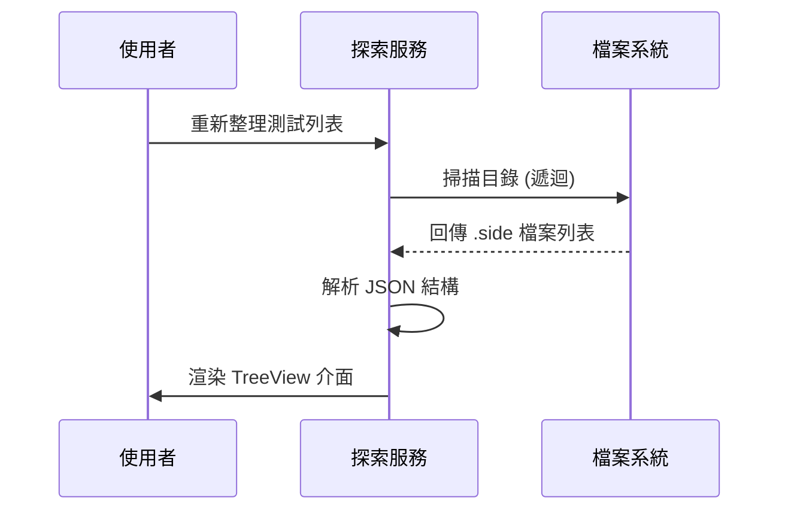

# 🏗️ 系統架構總覽 (Architecture Overview)

**Enterprise HIS Test Execution System** 的設計核心在於「測試編排 (Orchestration)」與「測試執行 (Execution)」的解耦。透過這個架構，我們能為複雜的醫療系統測試提供一個穩定、高效且可視化的管理介面。

## 📐 系統設計圖 (System Design)

本系統採用 **Hollow-Core Architecture（空心核心架構）**：UI 層 (UI Layer) 僅作為指揮官，負責發號施令與監控，實際的繁重測試工作則委派給專門的子進程 (Subprocesses) 處理。

```mermaid
graph TD
    subgraph "Core Application (C# / .NET 8)"
        UI[MainForm UI] --> Config[Configuration Manager<br>設定管理器]
        UI --> Discovery[Test Discovery Service<br>測試探索服務]
        UI --> Executor[Test Executor Service<br>測試執行服務]
        UI --> Analyzer[Failure Analyzer Engine<br>錯誤分析引擎]
    end

    subgraph "Test Execution Layer (Python)"
        Executor -->|啟動| PyScheduler[Scheduler V2<br>排程器]
        PyScheduler -->|生成| Worker1[Worker Process 1]
        PyScheduler -->|生成| Worker2[Worker Process N]
        Worker1 -->|操作| App[被測目標應用程式 (HIS)]
    end

    subgraph "Reporting Layer (Java)"
        UI -->|呼叫| AllureCLI[Allure Commandline]
        AllureCLI -->|產生| Report[HTML 測試報告]
    end

    subgraph "Data Persistence"
        Config <--> ConfigFile[runner_config.json]
        Analyzer <--> History[History & Trends DB]
    end
```

## 🔄 核心工作流程 (Core Workflows)

### 1. 智慧測試探索 (Test Discovery & Selection)
系統會遞迴掃描儲存庫中的測試案例 (`.side` 檔案)，並建立虛擬樹狀結構。這讓測試人員可以靈活地選擇執行粒度——從整個資料夾、特定套件 (Suite) 到單一測試案例。



### 2. 智慧執行編排 (Intelligent Execution Orchestration)
系統不會直接執行測試，而是先生成動態配置清單 (`runner_config.json`)，再喚起 Python Scheduler 進行調度。

**關鍵技術特點：**
*   **環境注入 (Environment Injection)**：自動注入 API Keys 和環境變數，實現「免登入驗證 (Bypass Auth)」，大幅縮短測試時間。
*   **進程隔離 (Process Isolation)**：每個測試 Worker 都在獨立的 Process 中運行，確保測試狀態互不干擾 (State Pollution Prevention)。
*   **即時串流 (Real-time Streaming)**：非同步捕捉標準輸出 (stdout/stderr) 並即時串流至 UI，讓工程師能看到與 IDE 一樣詳細的 Log，且不會阻塞主執行緒。

### 3.錯誤分析引擎 (Failure Analysis Engine)
這不僅僅是一個「顯示錯誤」的功能，而是一個具備分析能力的引擎。它會解析執行日誌與 Allure 報告來將錯誤分類。

*   **特徵匹配 (Pattern Matching)**：使用 Regex 規則庫識別常見錯誤（例如："Element not found", "API Timeout"）。
*   **智慧分組 (Smart Grouping)**：自動將不同測試案例但原因相同的錯誤分組（例如：50 個測試失敗都是因為「登入超時」），加速問題排查。
*   **診斷建議 (Diagnosis Suggestions)**：根據錯誤特徵提供修復建議（例如：「檢測到 VPN 斷線，請檢查網路」）。

## 🛠️ 技術棧 (Technology Stack)

| 元件 | 技術 | 職責 |
|-----------|------------|------|
| **Frontend** | Windows Forms (.NET 8) | 高效能原生桌面 UI |
| **Orchestrator** | C# Process API | 進程管理 (Process Management) 與 IPC 通訊 |
| **Execution** | Python 3.8+ | 測試腳本執行與邏輯控制 |
| **Reporting** | Allure Framework | 測試結果視覺化報告 |
| **Automation** | Selenium / Appium | 瀏覽器與應用程式操控 |

## 🔒 安全性與合規 (Security & Compliance)
*   **零資料留存 (Zero-Data Retention)**：Test Runner 本身不儲存任何病人個資。
*   **本地執行 (Local Execution)**：所有測試皆在本地或安全內網環境執行，無外部雲端依賴。
