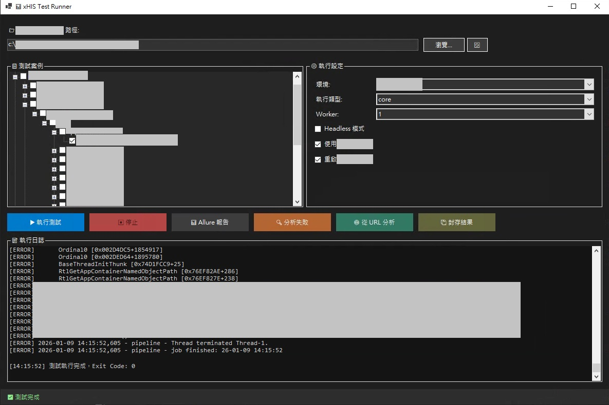

# 📊 醫療資訊系統智慧測試執行器 (Intelligent Test Runner for Enterprise HIS)

> **說明**：本儲存庫為**作品集展示 (Portfolio Showcase)**。原始程式碼屬於專有財產。本儲存庫旨在展示本工具的架構設計、設計模式以及技術能力。

這是一個專為 **醫療資訊系統 (HIS, Healthcare Information Systems)** 複雜測試流程所打造的高效能桌面應用程式。它成功橋接了底層自動化腳本與高層品質管理需求。

## 🌟 開發背景與挑戰

醫療系統的自動化測試通常面臨以下嚴峻挑戰：
*   **複雜的業務流程**：掛號、計價、病歷書寫涉及多步驟且具狀態性 (Stateful) 的互動。
*   **異質技術堆疊**：必須同時測試 Windows Native App (Win32) 與 Web View (Electron)，甚至需要與醫療硬體介接。
*   **環境配置漂移 (Configuration Drift)**：測試環境擁有數百個參數與金鑰，手動管理極易出錯。

**本 Test Runner 透過提供統一的「中央指揮中心」解決了上述所有問題。**

## ✨ 核心特色

### 🖥️ 高效能原生 UI (Native Performance)
採用 **.NET 8 Windows Forms** 建構，相比 Electron 架構的 Runner，擁有極致的啟動速度與極低的記憶體佔用。
*   **深色模式 (Dark Mode)**：專為長時間除錯的工程師設計，降低視覺疲勞。
*   **非阻塞式設計 (Non-blocking)**：運用進階的 Async/Await 模式，在處理繁重背景任務時保持 UI 絕對流暢。

### 🧠 智慧錯誤分析 (Smart Failure Analysis)
它不只告訴你「測試失敗」，它還能告訴你 **「為什麼」**。
*   **日誌解析 (Log Parsing)**：自動分析執行日誌，提取關鍵 Stack Trace。
*   **啟發式診斷 (Heuristic Diagnosis)**：根據錯誤模式提供修復建議（例如：「偵測到選擇器路徑失效」或「VPN 連線中斷」）。
*   **智慧分組**：將 50+ 個失敗案例自動歸納為 3 個根本原因 (Root Causes)，節省 90% 的分類時間。

### 📊 一鍵報告生成 (One-Click Reporting)
與 **Allure Framework** 無縫整合。
*   **自動化部署**：工具會自動管理 Allure CLI 執行環境 (包含 Java)，使用者無需手動設定環境變數。
*   **視覺化圖表**：生成互動式 HTML 報告，包含趨勢分析與時間軸視圖。

## 🏗️ 系統架構

請參閱 [ARCHITECTURE.md](ARCHITECTURE.md) 以獲得關於系統設計的深入資訊，包含：
*   進程管理 (Process Management) 與 IPC 通訊
*   插件化測試探索機制 (Test Discovery)
*   資料流圖 (Data Flow Diagrams)

## 🚀 功能演示 (Capabilities Demo)

### 執行儀表板 (Execution Dashboard)
支援 ANSI 色彩顯示的即時控制台輸出。

1.  **測試案例選擇**：樹狀視圖管理 500+ 個整合測試案例。
2.  **分析視圖**：分組後的錯誤分析與診斷建議。

## 🔧 技術亮點

*   **混合自動化支援 (Hybrid Automation)**：無縫協調 **Selenium (Web)** 與 **Windows UI Automation (Desktop)** 測試。
*   **動態配置 (Dynamic Configuration)**：執行時動態生成設定，並注入「魔法驗證權杖 (Magic Verification Tokens)」以繞過標準 OTP 流程。
*   **強健性 (Robustness)**：實作「自我修復 (Self-Healing)」機制，當 Worker 進程卡死時能自動重啟，確保整個測試套件不會中斷。

